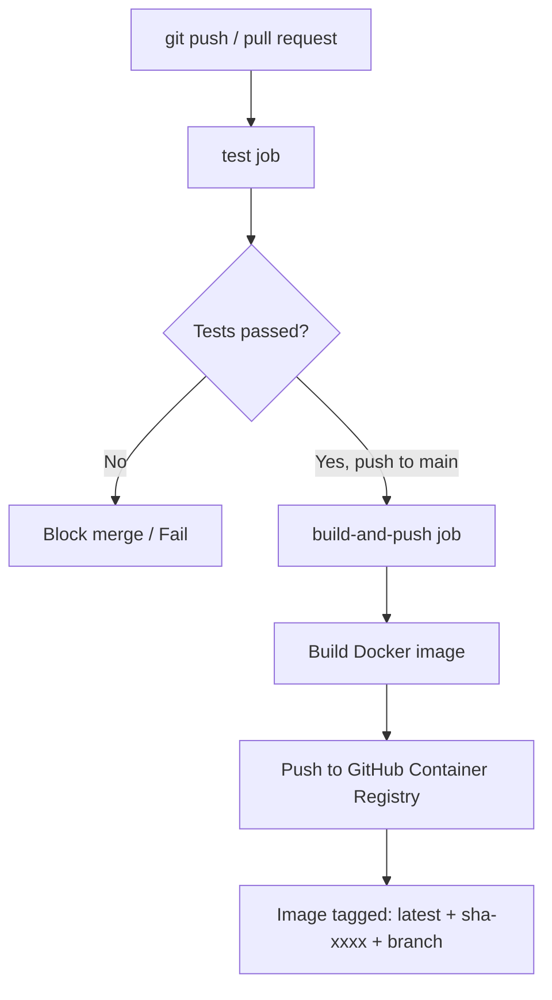

# House Price Prediction Model with Flask

A machine learning project that trains a linear regression model to predict house prices and deploys it via a Flask REST API with a beautiful, interactive web UI.

## ✨ Features

✅ **Interactive Web UI** - Beautiful, user-friendly interface for making predictions  
✅ **Real-time Filtering** - Filter dataset by income, age, and location  
✅ **Quick Sample Selection** - Load pre-existing data with one click  
✅ **Similar Properties Display** - See comparable properties from the dataset  
✅ **Dataset Statistics** - View averages, ranges, and distribution  
✅ **REST API** - Full-featured API for programmatic access  
✅ **Responsive Design** - Works on desktop, tablet, and mobile  
✅ **No External Dependencies** - Frontend uses vanilla JavaScript  

## 📊 Model Performance

- **RMSE**: 0.7456 (Root Mean Squared Error)
- **R² Score**: 0.5758 (57.58% of variance explained)
- **Dataset**: California Housing (20,640 samples, 8 features)
- **Algorithm**: Linear Regression

## 🚀 Quick Start

### Prerequisites
- Python 3.7+
- pip (Python package manager)

### Installation & Setup

1. Navigate to the project directory:
```bash
cd house_price_prediction
```

2. Install required dependencies:
```bash
pip install -r requirements.txt
```

3. Train the model (if not already trained):
```bash
python train_model.py
```

4. Start the Flask application:
```bash
python app.py
```

5. Open your browser and go to:
```
http://localhost:5000
```

## 📁 Project Structure

```
house_price_prediction/
├── app.py                          # Flask application
├── train_model.py                  # Model training script
├── test_api.py                     # Manual API smoke-test script
├── requirements.txt                # Python dependencies (incl. pytest)
├── pytest.ini                      # Pytest configuration
├── Dockerfile                      # Container image definition
├── README.md                       # This file
├── QUICKSTART.md                   # Quick start guide
├── UI_GUIDE.md                     # Detailed UI guide
├── .github/
│   └── workflows/
│       └── ci-cd.yml               # GitHub Actions CI/CD pipeline
├── tests/                          # Automated test suite
│   ├── __init__.py
│   ├── conftest.py                 # Shared fixtures & model bootstrap
│   ├── test_app.py                 # Flask API tests (34 cases)
│   └── test_model.py               # ML pipeline tests (19 cases)
├── models/                         # Trained model directory
│   ├── house_price_model.pkl       # Trained model
│   └── feature_names.pkl           # Feature names
├── templates/                      # HTML templates
│   └── index.html                  # Main UI page
└── static/                         # Static assets
    ├── style.css                   # UI styling
    └── script.js                   # UI interactivity
```

## 🎨 Web Interface Overview

### Main Sections

**1. Prediction Form (Left Panel)**
- Quick select from 50 dataset samples
- Manual input with validation
- Helpful hints for each feature
- Real-time form updates

**2. Results Display (Right Panel)**
- Large predicted price display
- Total price calculation
- Model confidence metrics
- 5 most similar properties from dataset

**3. Dataset Filters**
- Filter by income level (Low/Medium/High)
- Filter by house age (New/Medium/Old)
- Filter by location (Northern/Central/Southern CA)
- Real-time dataset statistics

**4. Browsable Samples**
- Grid view of filtered samples
- Click to load into prediction form
- Details: income, age, rooms, location, price

For detailed UI guide, see [UI_GUIDE.md](UI_GUIDE.md)

## 🔌 API Endpoints

### Web UI Endpoints

```
GET  /                    Access the web interface
GET  /api/dataset         Get all dataset samples (for UI)
GET  /api/statistics      Get dataset statistics
GET  /api/health         Health check
GET  /api/features       Get required features list
```

### Prediction Endpoints

```
POST /api/predict        Make single prediction
     Body: {"features": [val1, val2, ..., val8]}
     or: {"MedInc": val, "HouseAge": val, ...}

POST /api/predict-batch  Make batch predictions
     Body: {"data": [[val1, ..., val8], [val1, ..., val8]]}
```

### Legacy Endpoints (Backward Compatible)

```
GET  /features           Get required features
POST /predict            Make single prediction
POST /predict-batch      Make batch predictions
GET  /health            Health check
```

## 📋 Features Used

The model uses the California Housing dataset with 8 features:

| Feature | Description | Range |
|---------|-------------|-------|
| **MedInc** | Median income in block group ($10K) | 0.5 - 15.0 |
| **HouseAge** | Median house age (years) | 1 - 52 |
| **AveRooms** | Average rooms per household | 1.0 - 141.0 |
| **AveBedrms** | Average bedrooms per household | 0.33 - 34.07 |
| **Population** | Block group population | 3 - 35,682 |
| **AveOccup** | Average occupancy per household | 0.69 - 55.23 |
| **Latitude** | Block group latitude | 32.54 - 41.95 |
| **Longitude** | Block group longitude | -124.35 - -114.13 |

## 🧪 Testing

### Test Requirements

The automated test suite requires the following packages (all included in `requirements.txt`):

| Package | Version | Purpose |
|---|---|---|
| `pytest` | >=8.0.0 | Test runner and discovery |
| `pytest-cov` | >=5.0.0 | Code coverage reporting |
| `Flask` | >=3.0.0 | Provides the test client (`app.test_client()`) |
| `scikit-learn` | >=1.5.0 | Model training and assertions in ML tests |
| `numpy` | >=1.26.0 | Array operations used in test fixtures |
| `pandas` | >=2.2.0 | DataFrame assertions |

Install all test dependencies in one step:
```bash
pip install -r requirements.txt
```

---

### Test Suite Overview

All tests live in the `tests/` directory and are discovered automatically by pytest.

#### `tests/conftest.py` — Shared Fixtures

| Fixture | Scope | Description |
|---|---|---|
| `_ensure_test_model()` | module (auto) | Creates a minimal trained model if `models/` is empty, so tests never require a pre-trained model |
| `app` | session | Configures Flask in `TESTING` mode |
| `client` | session | Returns a `FlaskClient` for making in-process HTTP requests |

#### `tests/test_app.py` — Flask API Tests (34 test cases)

| Class | Endpoint | Cases |
|---|---|---|
| `TestHomeEndpoint` | `GET /` | Returns HTTP 200; response body contains HTML |
| `TestHealthEndpoint` | `GET /api/health` | HTTP 200; `status == "healthy"`; `model_loaded == true` |
| `TestFeaturesEndpoint` | `GET /api/features` | HTTP 200; exactly 8 features; correct feature names; has description |
| `TestStatisticsEndpoint` | `GET /api/statistics` | HTTP 200; all 6 stat fields present; numeric types; min ≤ max |
| `TestDatasetEndpoint` | `GET /api/dataset` | HTTP 200; returns list; `?limit=` param respected; samples have `price` key |
| `TestPredictEndpoint` | `POST /api/predict` | Array format; dict format; both return same float; too-few features → 400; missing key → 400; empty body → 400; error message mentions expected count |
| `TestBatchPredictEndpoint` | `POST /api/predict-batch` | Correct count; `status == "success"`; single-row; matches single-predict value; wrong feature count → 400; missing `data` key → error |

#### `tests/test_model.py` — ML Pipeline Tests (19 test cases)

| Class | What is tested |
|---|---|
| `TestFeatureNames` | Feature list has exactly 8 string entries; required names present |
| `TestModelTraining` | `LinearRegression.fit()` succeeds; `coef_` shape matches feature count; R² ≈ 1.0 on linear data; RMSE < 0.01 |
| `TestModelPredictions` | Returns `ndarray`; correct output shape; single-row scalar; all values finite; wrong feature count raises `ValueError` |
| `TestModelPersistence` | Pickle round-trip produces identical predictions; feature names survive pickle; loaded model output shape matches original |
| `TestDataPreprocessing` | 80/20 split produces correct sizes; no NaN in data; feature matrix has 8 columns |

---

### Running Tests Locally

#### 1. Train the model first
```bash
python train_model.py
```
> The `conftest.py` fixture will create a minimal synthetic model automatically if this step is skipped, so tests still pass in a clean checkout.

#### 2. Run the full test suite
```bash
pytest
```

#### 3. Run with verbose output
```bash
pytest -v
```

#### 4. Run a specific test file
```bash
pytest tests/test_app.py -v
pytest tests/test_model.py -v
```

#### 5. Run a specific test class or case
```bash
pytest tests/test_app.py::TestPredictEndpoint -v
pytest tests/test_app.py::TestPredictEndpoint::test_predict_array_format_returns_200 -v
```

#### 6. Run with code coverage
```bash
pytest --cov=app --cov-report=term-missing
```

#### 7. Generate HTML coverage report
```bash
pytest --cov=app --cov-report=html
# Report saved to htmlcov/index.html
```

#### Expected output
```
======================= 53 passed in 0.27s =======================
```

---

### `pytest.ini` Configuration

```ini
[pytest]
testpaths = tests
python_files = test_*.py
python_classes = Test*
python_functions = test_*
addopts = -v --tb=short
```

| Option | Effect |
|---|---|
| `testpaths = tests` | Only look for tests inside `tests/` |
| `python_files = test_*.py` | Discover files matching `test_*.py` |
| `addopts = -v --tb=short` | Always run verbose with short tracebacks |

---

### Manual API Testing (cURL)

```bash
# Health check
curl http://localhost:5000/api/health

# Get feature list
curl http://localhost:5000/api/features

# Dataset statistics
curl http://localhost:5000/api/statistics

# Single prediction — array format
curl -X POST http://localhost:5000/api/predict \
  -H "Content-Type: application/json" \
  -d '{"features": [8.3252, 41.0, 6.984127, 1.023810, 322.0, 2.555556, 37.88, -122.23]}'

# Single prediction — dictionary format
curl -X POST http://localhost:5000/api/predict \
  -H "Content-Type: application/json" \
  -d '{"MedInc":8.3252,"HouseAge":41.0,"AveRooms":6.984127,"AveBedrms":1.02381,"Population":322.0,"AveOccup":2.555556,"Latitude":37.88,"Longitude":-122.23}'

# Batch prediction
curl -X POST http://localhost:5000/api/predict-batch \
  -H "Content-Type: application/json" \
  -d '{"data":[[8.3252,41.0,6.984127,1.02381,322.0,2.555556,37.88,-122.23],[8.3014,21.0,6.238137,0.97188,2401.0,2.109842,37.86,-122.22]]}'
```

---

## 🔄 CI/CD Pipeline (GitHub Actions)

The pipeline is defined in `.github/workflows/ci-cd.yml` and runs automatically on every push and pull request to `main`/`master`.

### Pipeline Overview



---

### Job 1 — `test` (runs on every push and PR)

| Step | Action |
|---|---|
| Checkout | `actions/checkout@v4` — checks out source code |
| Python setup | `actions/setup-python@v5` — Python 3.12 with pip cache |
| Install deps | `pip install -r requirements.txt pytest pytest-cov` |
| Train model | `python train_model.py` — creates `models/*.pkl` before tests run |
| Run tests | `pytest tests/ --cov=app --cov-report=xml --junitxml=test-results.xml` |
| Upload test results | JUnit XML artifact — visible in the GitHub Actions summary |
| Upload coverage | `coverage.xml` artifact — can be consumed by Codecov or similar |

**Trigger conditions:** `push` to `main`/`master`, any `pull_request` targeting those branches.

---

### Job 2 — `build-and-push` (runs only on push to `main`/`master`)

**Requires:** `test` job to pass.

| Step | Action |
|---|---|
| Checkout | `actions/checkout@v4` |
| Docker Buildx | `docker/setup-buildx-action@v3` — enables multi-platform builds |
| Login to GHCR | `docker/login-action@v3` — authenticates with `secrets.GITHUB_TOKEN` |
| Extract metadata | `docker/metadata-action@v5` — auto-generates tags and OCI labels |
| Build & push | `docker/build-push-action@v6` — builds image and pushes to GHCR with layer cache |

**Image tags produced:**

| Tag | Example | When applied |
|---|---|---|
| `latest` | `ghcr.io/org/repo:latest` | Default branch pushes only |
| Branch name | `ghcr.io/org/repo:main` | Every push to that branch |
| Short SHA | `ghcr.io/org/repo:sha-a1b2c3d` | Every push — enables rollbacks |

---

### Required GitHub Repository Permissions

No manual secrets need to be created. The pipeline uses the built-in `GITHUB_TOKEN` for GHCR access:

```yaml
permissions:
  contents: read
  packages: write    # allows push to ghcr.io
```

Enable this in **Settings → Actions → General → Workflow permissions** → _Read and write permissions_.

---

### Pulling the Published Image

```bash
# Latest stable build
docker pull ghcr.io/<your-github-username>/<repo-name>:latest

# Specific commit (safe for production)
docker pull ghcr.io/<your-github-username>/<repo-name>:sha-a1b2c3d

# Run the container
docker run -p 5000:5000 ghcr.io/<your-github-username>/<repo-name>:latest
```

---

### Dockerfile

The `Dockerfile` trains the model during the image build so the container ships with a ready-to-serve model:

```dockerfile
FROM python:3.12-slim

WORKDIR /app

COPY requirements.txt .
RUN pip install --no-cache-dir -r requirements.txt

COPY . .

# Bake trained model into the image
RUN python train_model.py

EXPOSE 5000
CMD ["gunicorn", "-w", "4", "-b", "0.0.0.0:5000", "app:app"]
```

Build and run locally:
```bash
docker build -t house-price-predictor .
docker run -p 5000:5000 house-price-predictor
```

---

### Using the Web UI (Manual Testing)

1. Open http://localhost:5000
2. Select a sample or enter manual values
3. Click "Predict Price"
4. Explore filters and browse the dataset

## 🛠️ Development

### Training the Model

To retrain the model with different data or parameters:

```bash
python train_model.py
```

This will:
- Load the California Housing dataset
- Split into 80/20 train-test sets
- Train linear regression model
- Evaluate and save model to `models/`
- Display performance metrics

### Project Scripts

- **app.py** - Flask web server
- **train_model.py** - Model training script
- **test_api.py** - Manual API smoke-test (requires running server)
- **tests/test_app.py** - Automated Flask API tests (34 cases)
- **tests/test_model.py** - Automated ML pipeline tests (19 cases)
- **quickstart.sh** - Quick start bash script

## 📦 Dependencies

```
Flask>=3.0.0              # Web framework
scikit-learn>=1.5.0       # Machine learning
numpy>=1.26.0             # Numerical computing
pandas>=2.2.0             # Data manipulation
gunicorn>=21.0.0          # Production WSGI server
pytest>=8.0.0             # Test runner
pytest-cov>=5.0.0         # Coverage reporting
```

See [requirements.txt](requirements.txt) for exact versions.

## 🚀 Production Deployment

### Using Gunicorn

1. Install Gunicorn:
```bash
pip install gunicorn
```

2. Run production server:
```bash
gunicorn -w 4 -b 0.0.0.0:5000 app:app
```

### Using Docker

The included `Dockerfile` trains the model at build time:

```bash
# Build image
docker build -t house-price-predictor .

# Run container
docker run -p 5000:5000 house-price-predictor

# Or pull the pre-built image from GHCR (after CI publishes it)
docker pull ghcr.io/<your-github-username>/<repo-name>:latest
docker run -p 5000:5000 ghcr.io/<your-github-username>/<repo-name>:latest
```

### Best Practices

- [ ] Use production WSGI server (Gunicorn, uWSGI)
- [ ] Set `debug=False` in Flask
- [ ] Use environment variables for configuration
- [ ] Add input validation and error handling
- [ ] Implement comprehensive logging
- [ ] Use HTTPS/SSL in production
- [ ] Set up monitoring and alerting
- [ ] Implement rate limiting
- [ ] Add database for prediction history (optional)

## 🎯 Use Cases

1. **Real Estate Valuation** - Estimate property values
2. **Market Analysis** - Understand pricing trends
3. **Investment Decisions** - Compare similar properties
4. **Data Exploration** - Learn from the dataset
5. **API Integration** - Use predictions in other apps
6. **ML Education** - Study linear regression models

## 📊 Model Interpretation

- The model explains ~58% of price variance (R² = 0.5758)
- RMSE of 0.7456 means predictions are typically off by ±0.7456 ($74,560)
- Better for bulk estimates than individual high-value properties
- Works well within the training data range

## 🔍 Troubleshooting

**Port 5000 already in use:**
```bash
# On Linux/Mac:
lsof -ti:5000 | xargs kill -9

# On Windows:
netstat -ano | findstr :5000
taskkill /PID <PID> /F
```

**Model not found error:**
```bash
# Make sure to train the model first:
python train_model.py
```

**Dependencies not installing:**
```bash
# Update pip and try again:
pip install --upgrade pip
pip install -r requirements.txt
```

## 📚 Additional Resources

- [UI Guide](UI_GUIDE.md) - Detailed web interface documentation
- [Quick Start](QUICKSTART.md) - Getting started guide
- [scikit-learn Documentation](https://scikit-learn.org/)
- [Flask Documentation](https://flask.palletsprojects.com/)

## 📝 License

MIT License - See LICENSE file for details

## 🤝 Contributing

Contributions are welcome! Feel free to:
- Report bugs
- Suggest improvements
- Submit pull requests
- Add new features

## 📞 Support

For issues or questions:
1. Check the [UI_GUIDE.md](UI_GUIDE.md)
2. Review the [QUICKSTART.md](QUICKSTART.md)
3. Run the automated test suite: `pytest -v`
4. Run the manual smoke-test (server must be running): `python test_api.py`

---

**Built with ❤️ using Flask, scikit-learn, and vanilla JavaScript**

Happy predicting! 🎉
